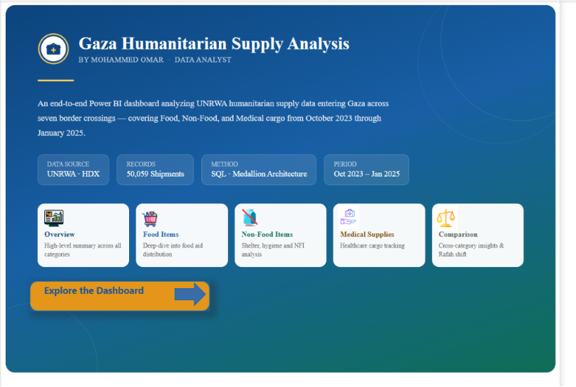
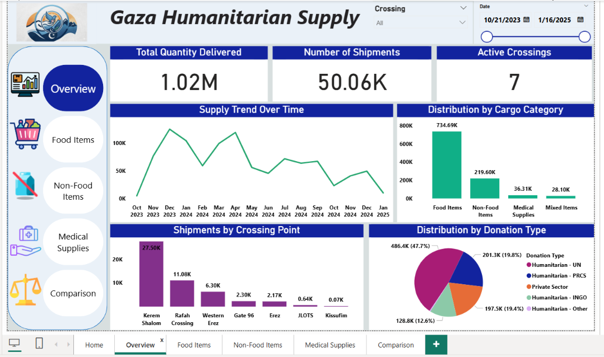
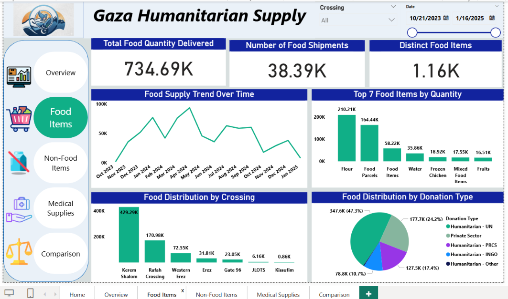
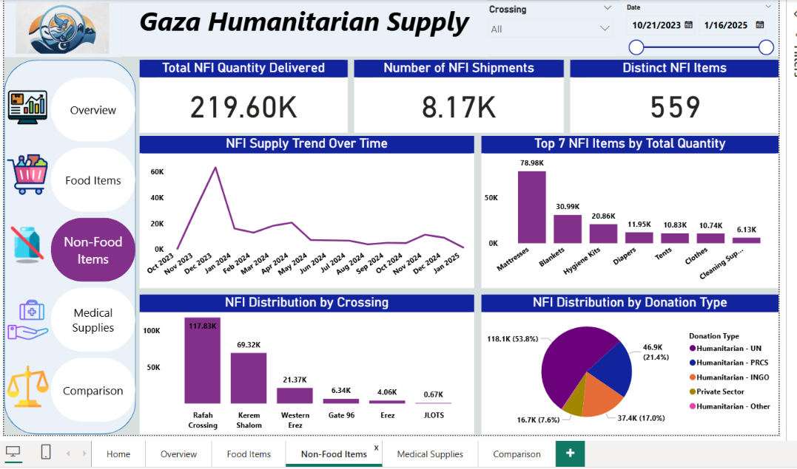
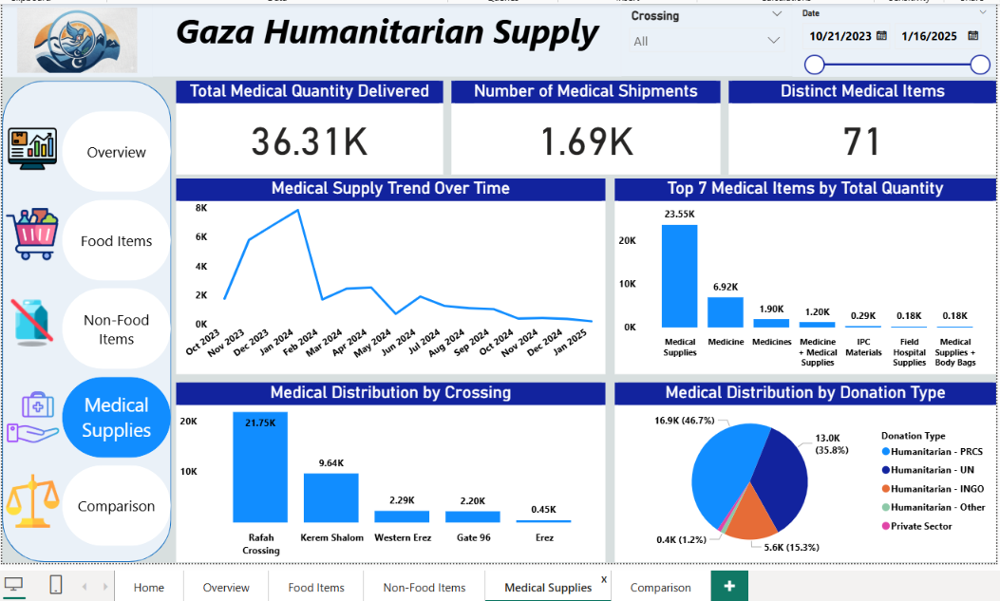
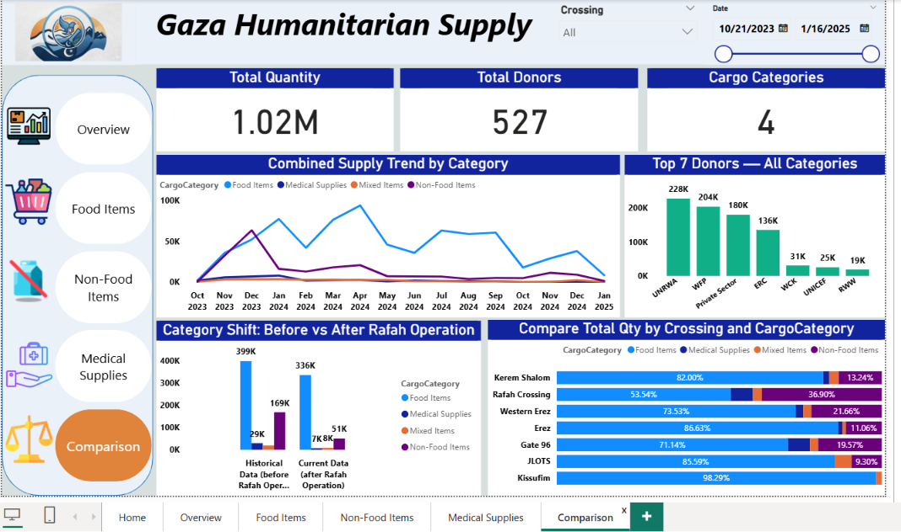

# Gaza Humanitarian Supply Analysis

An end-to-end data analytics project analyzing humanitarian supply data entering Gaza — built with SQL Server and Power BI, following a Medallion (Bronze/Silver/Gold) architecture.



## 📌 Overview

This project analyzes **50,059 shipment records** of humanitarian aid entering Gaza across **7 border crossings**, covering **Food Items, Non-Food Items (NFI), Medical Supplies, and Mixed Items**, over the period **October 21, 2023 – January 16, 2025**.

The dashboard is built as a 5-page interactive Power BI report (plus a landing page), each page focused on a specific analytical angle: category-level deep-dives and a cross-category comparison highlighting the shift in supply composition before and after the Rafah Crossing operation.

## 🎯 Objectives

- Track the volume and composition of humanitarian cargo entering Gaza over time
- Break down supply by category (Food / Non-Food / Medical / Mixed), crossing point, and donor type
- Compare supply patterns before and after the Rafah Operation
- Demonstrate an end-to-end analytics pipeline: raw data → SQL data warehouse → BI dashboard

## 🗂️ Data Source

- **Source:** UNRWA — Gaza Supply Dashboard, via [Humanitarian Data Exchange (HDX)](https://data.humdata.org)
-  
- **Records:** 50,059
- **Period covered:** Oct 21, 2023 – Jan 16, 2025
- **Category breakdown:**

  | Category | Records |
  |---|---|
  | Food Items | 38,390 |
  | Non-Food Items | 8,165 |
  | Mixed Items | 1,812 |
  | Medical Supplies | 1,692 |

> **Note on data limitations:** `Distinct Item` counts are inflated in places because the source data uses free-text, sometimes compound descriptions (e.g. *"Bulgur + Pasta + Rice + Tomato Paste"*) rather than a standardized product catalog. This is a source-data characteristic, not a processing error, and is documented here for transparency.

## 🏗️ Architecture

```
Excel (raw) → CSV → SQL Server (Bronze → Silver → Gold) → Power BI
```

| Layer | Description |
|---|---|
| **Bronze** | Raw data loaded as-is via `BULK INSERT`, no transformations |
| **Silver** | Cleaned view — missing values in text columns replaced with explicit placeholders (`Not Specified`, `Unknown`, `Not Recorded`); no rows are ever dropped |
| **Gold** | Five pre-aggregated views, one per dashboard page, ready for direct import into Power BI |

SQL scripts are available in [`/sql`](./sql):
- [`01_bronze_layer.sql`](./sql/01_bronze_layer.sql)
- [`02_silver_layer.sql`](./sql/02_silver_layer.sql)
- [`03_gold_layer.sql`](./sql/03_gold_layer.sql)

## 📊 Dashboard Pages

| Page | Description |
|---|---|
| **Home** | Landing page — project summary, data source, methodology, navigation |
| **Overview** | High-level KPIs and trends across all cargo categories |
| **Food Items** | Deep-dive into food aid: top items, donors, trend, distribution by crossing |
| **Non-Food Items** | Deep-dive into NFI (shelter, hygiene, mattresses, blankets, etc.) |
| **Medical Supplies** | Deep-dive into medical/health cargo |
| **Comparison** | Cross-category analysis, including the shift in supply mix before vs. after the Rafah Operation |

### Screenshots

| Overview | Food Items |
|---|---|
|  |  |

| Non-Food Items | Medical Supplies |
|---|---|
|  |  |

| Comparison |
|---|
|  |

## 🛠️ Tools & Skills Used

- **SQL Server** — data warehousing, Medallion architecture (Bronze/Silver/Gold), view-based transformation pipeline
- **Power BI / DAX** — data modeling, a standalone `DateTable` with time-intelligence-ready relationships, custom measures (`SUM`, `DISTINCTCOUNT`)
- **Data cleaning** — handling missing values, resolving CSV parsing edge cases (embedded commas in free-text fields)
- **Dashboard design** — consistent color system per category, custom KPI cards, unified navigation, and a dedicated landing page

## 📁 Repository Structure

```
Gaza_Humanitarian_Supply_Analysis/
├── README.md
├── data/
│   └── commodities-received-13.xlsx
├── sql/
│   ├── 01_bronze_layer.sql
│   ├── 02_silver_layer.sql
│   └── 03_gold_layer.sql
├── icons/
├── logo/
├── screenshots/
└── Gaza_Humanitarian_Supply_Dashboard.pbix
```

## 👤 Author

**Mohammed Omar**
Data Analyst | MEAL & Humanitarian Data Background
[LinkedIn](https://linkedin.com/in/mohammedomar02) · [GitHub](https://github.com/mohammed200255)

## 📄 Data Attribution

Data provided by UNRWA via the Humanitarian Data Exchange (HDX), used here for independent educational/portfolio analysis. This project is not affiliated with or endorsed by UNRWA.
